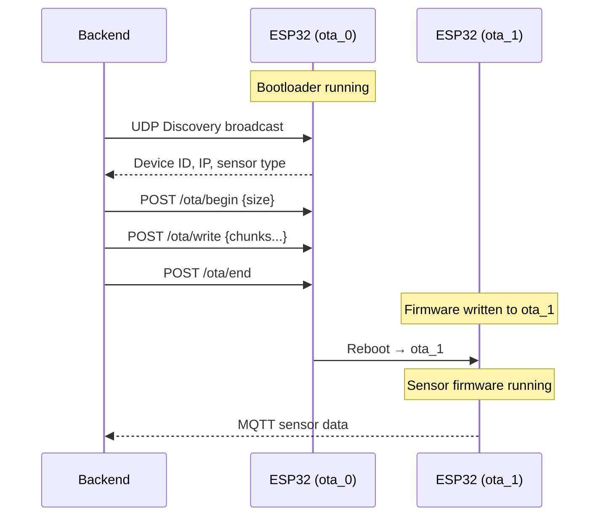

<p align="center">
  <h1 align="center">🔬 LabExpert — ESP32 Sensor Firmware</h1>
  <p align="center">
    <em>Modular, OTA-upgradable firmware suite for the LabExpert IoT sensor platform</em>
  </p>
  <p align="center">
    
    
    
    
    
    
  </p>
</p>

---

## 📖 Overview

This repository contains the complete embedded firmware ecosystem for the **LabExpert** platform — a modular IoT-based laboratory experiment system. Each sensor module is powered by an **ESP32** and communicates with a central backend over **WiFi + MQTT**. Firmware is deployed wirelessly via a **dual-partition OTA (Over-The-Air)** update mechanism.

### Key Highlights

- 🔄 **Dual-Partition OTA** — Bootloader on `ota_0`, experiment firmware on `ota_1` with automatic failsafe rollback
- 📡 **MQTT Telemetry** — Real-time sensor data streaming with binary-packed payloads
- 📶 **BLE Provisioning** — Zero-config WiFi setup via Bluetooth Low Energy (NimBLE)
- 🔍 **UDP Auto-Discovery** — Backend automatically discovers sensor modules on the local network
- 🧩 **Modular Architecture** — Shared libraries, per-sensor firmware generators, and a common hardware abstraction
- 💾 **EEPROM-Based Sensor ID** — Each sensor module carries a unique identity via an AT24C02 I2C EEPROM

---

## 📁 Repository Structure

```
LabExpert_Sensor_ESP32_CODES/
│
├── ESP_32_OTA/                        # 🔧 OTA Bootloader (always on ota_0)
│   ├── src/
│   │   ├── main.cpp                   #    Core bootloader logic
│   │   ├── wifi_credentials.cpp/h     #    BLE-based WiFi credential manager
│   ├── partitions/
│   │   └── custom_partitions.csv      #    Dual OTA partition table
│   └── platformio.ini
│
├── THR_Firmware_bin_Generator/        # 🌡️  Temperature (DS18B20) firmware
│   ├── src/
│   │   ├── main.cpp                   #    Entry point & init
│   │   ├── sensor_communication.cpp   #    DS18B20 OneWire driver
│   │   ├── experiment_manager.cpp     #    Sampling loop & data batching
│   │   ├── mqtt_handler.cpp           #    MQTT pub/sub & commands
│   │   └── config_handler.cpp         #    HTTP API & experiment config
│   ├── include/                       #    Header files
│   ├── partitions/                    #    Partition table
│   └── platformio.ini
│
├── TOF_Firmware_bin_Generator/        # 📏 Time-of-Flight (VL53L1X) firmware
│   ├── src/
│   │   ├── main_sensor.cpp            #    Entry point (dual-core init)
│   │   ├── sensor_communication.cpp   #    I2C VL53L1X driver (10–50 Hz)
│   │   ├── experiment_manager.cpp     #    Timer ISR + Core 0 sensor task
│   │   ├── motor_controller.cpp       #    DC motor control (PWM + encoder)
│   │   ├── mqtt_handler.cpp           #    MQTT with binary data packets
│   │   └── config_handler.cpp         #    HTTP API, OTA upload handler
│   ├── include/
│   ├── partitions/
│   ├── Implementation_Guide.md        #    Detailed I2C migration docs
│   └── platformio.ini
│
├── OSI_Firmware_bin_Generator/        # 〰️  Oscillation Sensor firmware
│   ├── src/
│   │   ├── main_sensor.cpp
│   │   ├── sensor_communication.cpp
│   │   ├── experiment_manager.cpp
│   │   ├── mqtt_handler.cpp
│   │   └── config_handler.cpp
│   ├── EEPROM_driver.cpp              #    AT24C02 test/debug utility
│   ├── partitions/
│   └── platformio.ini
│
├── UltraSonic_Firmware_bin_Generator/ # 📐 Ultrasonic (HC-SR04) firmware
│   ├── src/
│   │   ├── main_sensor.cpp
│   │   ├── sensor_communication.cpp
│   │   ├── experiment_manager.cpp
│   │   ├── mqtt_handler.cpp
│   │   └── config_handler.cpp
│   ├── partitions/
│   └── platformio.ini
│
├── BH1750/                            # 💡 Light Intensity calibration tool
│   ├── src/
│   │   └── main.cpp                   #    Calibration wizard (Arduino Uno)
│   └── platformio.ini
│
├── shared/                            # 📦 Shared libraries (all firmwares)
│   ├── LedController.h / .cpp         #    Multi-mode LED driver
│   ├── nvs_wifi_credentials.h         #    NVS WiFi credential reader
│   └── nvs_mqtt_credentials.h         #    NVS MQTT credential manager
│
├── bluetoothConfigeration/            # 📲 Standalone BLE provisioning tool
│   ├── src/
│   │   └── main.cpp                   #    NimBLE UART service (Nordic)
│   └── platformio.ini
│
├── R_W_E_EEPROM_arduino_uno/          # 🔧 EEPROM utility (Arduino Uno)
│   └── read_write_erase_for_arduino_uno/
│       └── read_write_erase_for_arduino_uno.ino
│
├── Binn/                              # 📦 Binary firmware generators
│   ├── binFileGen/                    #    ESP32 binary builder
│   └── binFileGen - NodeMCU/          #    NodeMCU binary builder
│
├── docs/                              # 📚 Documentation & diagrams
│   └── esp32-ota/
│       ├── ESP32_OTA_Documentation.md #    Full OTA system documentation
│       ├── api_reference.md           #    REST API reference
│       ├── architecture.drawio        #    System architecture diagram
│       ├── flowchart.png              #    Boot flow diagram
│       ├── sequence_backend_push.png  #    Backend OTA sequence
│       ├── sequence_web_upload.png    #    Web upload sequence
│       └── state_diagram.png          #    State machine diagram
│
├── pin_usage.md                       # 📌 Complete GPIO pin mapping
├── .gitignore
└── README.md                          # ← You are here
```

---

## ⚙️ System Architecture

```
┌─────────────────────────────────────────────────────────────────┐
│                        LabExpert Backend                        │
│              (Python · MQTT Broker · REST API · DB)             │
└──────────────┬──────────────────────────────┬───────────────────┘
               │  MQTT (pub/sub)              │  UDP Discovery
               │  Port 1883                   │  Port 8888/8889
               ▼                              ▼
┌─────────────────────────────────────────────────────────────────┐
│                     ESP32 Sensor Module                         │
│  ┌───────────────────────────────────────────────────────────┐  │
│  │  Partition: ota_0 (1.5 MB)          ota_1 (1.5 MB)        │  │
│  │  ┌─────────────────────┐  ┌──────────────────────────┐   │  │
│  │  │   ESP_32_OTA        │  │  Sensor Firmware          │   │  │
│  │  │   (Bootloader)      │  │  (THR/TOF/OSI/ULT)       │   │  │
│  │  │                     │  │                           │   │  │
│  │  │  • BLE Provisioning │  │  • Sensor Reading         │   │  │
│  │  │  • WiFi Manager     │  │  • MQTT Publishing        │   │  │
│  │  │  • UDP Discovery    │  │  • Experiment Manager     │   │  │
│  │  │  • OTA Web Server   │  │  • HTTP Config API        │   │  │
│  │  │  • EEPROM Detection │  │  • Dual-Core Processing   │   │  │
│  │  └─────────────────────┘  └──────────────────────────┘   │  │
│  └───────────────────────────────────────────────────────────┘  │
│                                                                 │
│  ┌──────────┐  ┌──────────┐  ┌──────────┐  ┌──────────┐       │
│  │ AT24C02  │  │  Sensor  │  │  Status  │  │  Motor   │       │
│  │ EEPROM   │  │  Module  │  │  LEDs    │  │ (TOF)    │       │
│  │ (I2C)    │  │  (I2C/   │  │  ×5      │  │  (PWM)   │       │
│  │          │  │   1-Wire │  │          │  │          │       │
│  │          │  │   /GPIO) │  │          │  │          │       │
│  └──────────┘  └──────────┘  └──────────┘  └──────────┘       │
└─────────────────────────────────────────────────────────────────┘
```

### Boot Flow

1. **Power On** → ESP32 boots from `ota_0` (OTA Bootloader)
2. **EEPROM Check** → Reads sensor type ID from AT24C02 (`0x50`)
3. **WiFi Connect** → Loads credentials from NVS (saved via BLE provisioning)
4. **UDP Discovery** → Responds to backend broadcast, receives MQTT broker info
5. **OTA Push** → Backend pushes matching firmware binary to `ota_1`
6. **Reboot** → ESP32 boots into experiment firmware on `ota_1`
7. **Failsafe** → If EEPROM unreadable or firmware crashes, auto-rollback to `ota_0`

---

## 🧪 Supported Experiments

| ID | Experiment | Sensor | Firmware | Communication | Frequency |
|:--:|:-----------|:-------|:---------|:--------------|:----------|
| **THR** | Temperature | DS18B20 | `THR_Firmware_bin_Generator` | OneWire (Pin 23) | Configurable |
| **TOF** | Distance / Motion | VL53L1X (TOF400F) | `TOF_Firmware_bin_Generator` | I2C (Pin 21/22) | 10–50 Hz |
| **OSI** | Oscillation | Digital Sensor | `OSI_Firmware_bin_Generator` | GPIO (Pin 33) | Configurable |
| **ULT** | Distance | HC-SR04 | `UltraSonic_Firmware_bin_Generator` | GPIO Trig/Echo (Pin 21/22) | Configurable |
| **BH** | Light Intensity | BH1750 | `BH1750` (calibration only) | I2C (Pin 21/22) | 2 Hz (cal mode) |

---

## 🔌 Hardware Pin Map (ESP32)

| Pin | Function | Used By |
|:---:|:---------|:--------|
| **12** | BLE Status LED (Active Low) | All |
| **13** | Sensor Connected LED (Active Low) | All |
| **14** | WiFi Status LED (Active Low) | All |
| **16** | OTA Status LED (Active Low) | All |
| **18** | EEPROM SDA (I2C) | All |
| **19** | EEPROM SCL (I2C) | All |
| **21** | Sensor SDA / Trig | TOF, ULT, BH |
| **22** | Sensor SCL / Echo | TOF, ULT, BH |
| **23** | OneWire / LDR Encoder | THR, TOF |
| **25** | EEPROM Write Protect | OTA |
| **26** | Motor Left PWM / I2S WS | TOF |
| **27** | Sensor Active LED (Active Low) | All |
| **32** | OTA Restart Trigger | All Firmware |
| **33** | Motor Right PWM / OSI Sensor | TOF, OSI |
| **34** | BLE Trigger / Factory Reset | OTA |
| **35** | Limit Switch (OR Gate) | TOF |

> 📌 Full pin documentation with LED logic states available in [`pin_usage.md`](pin_usage.md)

### LED Status Indicators

| LED (Pin) | State | Meaning |
|:----------|:------|:--------|
| WiFi (14) | ON | Disconnected |
| WiFi (14) | Blink (Slow) | Connected |
| WiFi (14) | OFF | Bluetooth mode active |
| BLE (12) | ON | BLE advertising |
| BLE (12) | Blink | BLE connected |
| Sensor (13) | OFF | Sensor connected |
| Sensor (13) | ON | Sensor disconnected |
| Active (27) | Blink (Fast) | Experiment running |
| OTA (16) | Blink (Fast) | OTA restart triggered |

---

## 🛠️ Prerequisites

| Tool | Version | Purpose |
|:-----|:--------|:--------|
| [PlatformIO](https://platformio.org/) | Latest | Build system & dependency management |
| [VS Code](https://code.visualstudio.com/) | Latest | IDE (recommended with PlatformIO extension) |
| ESP32 Dev Board | ESP32-WROOM-32 | Target microcontroller |
| Arduino Uno | ATmega328P | BH1750 calibration & EEPROM utility |
| USB Cable | Micro-USB / USB-C | Initial flash & serial monitor |

---

## 🚀 Getting Started

### 1. Clone the Repository

```bash
git clone <repository-url>
cd LabExpert_Sensor_ESP32_CODES
```

### 2. Flash the OTA Bootloader (First Time Only)

The OTA bootloader must be flashed via USB **once**. After that, all firmware updates happen wirelessly.

```bash
cd ESP_32_OTA
pio run -t upload
pio device monitor        # Verify boot output
```

### 3. Build a Sensor Firmware Binary

Each sensor firmware generates a `.bin` file for OTA deployment:

```bash
cd THR_Firmware_bin_Generator    # Or TOF / OSI / UltraSonic
pio run                          # Compile firmware
```

The compiled binary is located at:
```
.pio/build/esp32dev/firmware.bin
```

### 4. Deploy via OTA

The backend automatically pushes the correct firmware via the OTA HTTP API:

```bash
# Manual OTA push (for testing)
curl -X POST "http://<esp32-ip>/update" \
  -F "update=@.pio/build/esp32dev/firmware.bin"
```

Or use the backend's programmatic OTA endpoint:
```
POST /ota/begin   →  { "size": <bytes> }
POST /ota/write   →  { "offset": 0, "size": 1024, "data": "<hex>" }
POST /ota/end     →  triggers reboot
```

---

## 📦 Shared Libraries

All sensor firmwares include shared code from the `shared/` directory via the `-I../shared` build flag.

### `LedController`

Multi-mode LED driver supporting active-low hardware with non-blocking blink patterns.

```cpp
#include "LedController.h"

LedController led(14, true);  // Pin 14, active-low

led.begin();
led.set(LedController::BLINK_SLOW);  // 1s on/off
led.set(LedController::BLINK_FAST);  // 200ms on/off
led.set(LedController::BLINK_PULSE); // 150ms on, 2850ms off
led.update();                         // Call in loop()
```

### `nvs_wifi_credentials.h`

Header-only NVS reader for WiFi credentials saved by the OTA bootloader's BLE provisioning.

```cpp
#include "nvs_wifi_credentials.h"

char ssid[33], password[65];
if (loadWiFiCredentialsFromNVS(ssid, sizeof(ssid), password, sizeof(password))) {
    WiFi.begin(ssid, password);
}
```

### `nvs_mqtt_credentials.h`

NVS-based MQTT broker credential manager with change detection to minimize flash writes.

```cpp
#include "nvs_mqtt_credentials.h"

// Save (OTA bootloader)
saveMQTTCredentialsToNVS("192.168.1.100", 1883, "aa:bb:cc:dd:ee:ff");

// Load (sensor firmware)
char broker[40]; uint16_t port; char mac[18];
loadMQTTCredentialsFromNVS(broker, sizeof(broker), &port, mac, sizeof(mac));
```

---

## 🔗 Firmware Module Architecture

Each sensor firmware (`THR`, `TOF`, `OSI`, `ULT`) follows a consistent modular pattern:

```
┌──────────────────────────────────────────────┐
│                  main.cpp                     │
│         (Init, WiFi, LED control, loop)       │
├──────────┬───────────┬───────────┬────────────┤
│  sensor_ │ experiment│   mqtt_   │  config_   │
│  communi │ _manager  │  handler  │  handler   │
│  cation  │           │           │            │
│          │           │           │            │
│ • Init   │ • Timer   │ • Setup   │ • Status   │
│ • Read   │   ISR     │ • Pub/Sub │ • Config   │
│ • EEPROM │ • Core 0  │ • Callback│ • Start    │
│ • Calib  │   task    │ • Binary  │ • Stop     │
│          │ • Batch   │   packets │ • OTA      │
└──────────┴───────────┴───────────┴────────────┘
        ▲                    ▲
        │                    │
   shared/              shared/
   LedController        nvs_*_credentials
```

| Module | Responsibility |
|:-------|:---------------|
| `main.cpp` / `main_sensor.cpp` | Hardware init, WiFi connection, LED management, main loop |
| `sensor_communication.cpp` | Sensor driver, EEPROM ID detection, device ID from MAC |
| `experiment_manager.cpp` | Timer ISR, sampling task (Core 0), data batching & buffering |
| `mqtt_handler.cpp` | MQTT connection, topic subscription, binary data publishing |
| `config_handler.cpp` | AsyncWebServer HTTP API (`/status`, `/config`, `/start`, `/stop`, `/update`) |

---

## 🌐 HTTP API Endpoints (Sensor Firmware)

| Method | Endpoint | Description |
|:-------|:---------|:------------|
| `GET` | `/status` | Current sensor status, experiment state, config |
| `GET` | `/config` | Read current experiment configuration |
| `POST` | `/config` | Set frequency, duration, mode |
| `POST` | `/start` | Start experiment data collection |
| `POST` | `/stop` | Stop running experiment |
| `POST` | `/update` | Upload firmware binary (multipart) |
| `GET` | `/id` | Get sensor type ID |

### OTA Bootloader Endpoints

| Method | Endpoint | Description |
|:-------|:---------|:------------|
| `GET` | `/` | OTA management web page |
| `GET` | `/info` | Sensor type & ID (JSON) |
| `GET` | `/ping` | Health check (`pong`) |
| `POST` | `/update` | Upload firmware (multipart form) |
| `POST` | `/ota/begin` | Start chunked OTA (`{ "size": N }`) |
| `POST` | `/ota/write` | Write chunk (`{ "offset", "size", "data" }`) |
| `POST` | `/ota/end` | Finalize OTA & reboot |
| `POST` | `/sensor/repair` | Rewrite EEPROM sensor ID |
| `GET` | `/id` | Get current sensor type |

---

## 🔄 OTA Update Flow



---

## 🧰 Utility Tools

### BH1750 Calibration Wizard (`BH1750/`)

Interactive serial tool for calibrating a BH1750 light sensor against a reference meter (UT383). Runs on **Arduino Uno**.

| Command | Action |
|:--------|:-------|
| `c` | Collect calibration data point |
| `s` | Show collected data |
| `f` | Calculate calibration factors (linear regression) |
| `r` | Reset data |
| `m` | Show current calibrated measurement |
| `d` | Debug / I2C scan |

```bash
cd BH1750
pio run -t upload
pio device monitor
```

### EEPROM Read/Write/Erase (`R_W_E_EEPROM_arduino_uno/`)

Serial tool for programming AT24C02 EEPROM sensor IDs. Runs on **Arduino Uno**.

| Option | Action |
|:-------|:-------|
| `1` | Write new Sensor ID |
| `2` | Read current Sensor ID |
| `3` | Erase EEPROM |
| `4` | Full hex dump (0x00–0xFF) |

### EEPROM Driver (`OSI_Firmware_bin_Generator/EEPROM_driver.cpp`)

Standalone AT24C02 test utility for **ESP32** with I2C scanning, page write, boundary tests, and full hex dump.

### Bluetooth Configuration (`bluetoothConfigeration/`)

Standalone BLE provisioning tool using **NimBLE** Nordic UART Service (NUS). Saves WiFi credentials to NVS Preferences on confirmation.

---

## 🗂️ Custom Partition Table

```
# Name,    Type,  SubType, Offset,    Size
nvs,       data,  nvs,     0x9000,    0x5000   (20 KB)
otadata,   data,  ota,     0xe000,    0x2000   (8 KB)
ota_0,     app,   ota_0,   0x10000,   0x180000 (1.5 MB) ← Bootloader
ota_1,     app,   ota_1,   0x190000,  0x180000 (1.5 MB) ← Sensor Firmware
spiffs,    data,  spiffs,  0x310000,  0x0F0000 (960 KB)
```

---

## 📚 Dependencies

### ESP32 Firmware (Common)

| Library | Version | Purpose |
|:--------|:--------|:--------|
| [ArduinoJson](https://github.com/bblanchon/ArduinoJson) | ^6.21 / ^7.4 | JSON serialization |
| [ESPAsyncWebServer](https://github.com/me-no-dev/ESPAsyncWebServer) | Latest | Async HTTP server |
| [AsyncTCP](https://github.com/me-no-dev/AsyncTCP) | ^1.1.1 | Async TCP for ESP32 |
| [WebSockets](https://github.com/Links2004/arduinoWebSockets) | ^2.4.1 | WebSocket support |
| [PubSubClient](https://github.com/knolleary/pubsubclient) | ^2.8 | MQTT client |

### Sensor-Specific

| Library | Firmware | Purpose |
|:--------|:---------|:--------|
| [DallasTemperature](https://github.com/milesburton/Arduino-Temperature-Control-Library) | THR | DS18B20 driver |
| [OneWire](https://github.com/PaulStoffregen/OneWire) | THR | OneWire protocol |
| [VL53L1X](https://github.com/pololu/vl53l1x-arduino) | TOF | Time-of-Flight sensor |
| [NimBLE-Arduino](https://github.com/h2zero/NimBLE-Arduino) | OTA | BLE provisioning |
| [BH1750](https://github.com/claws/BH1750) | BH1750 | Light sensor (Uno) |

---

## 📝 Documentation

| Document | Description |
|:---------|:------------|
| [`pin_usage.md`](pin_usage.md) | Complete GPIO pin mapping for all experiments |
| [`docs/esp32-ota/ESP32_OTA_Documentation.md`](docs/esp32-ota/ESP32_OTA_Documentation.md) | Full OTA system documentation |
| [`docs/esp32-ota/api_reference.md`](docs/esp32-ota/api_reference.md) | REST API reference |
| [`TOF_Firmware_bin_Generator/Implementation_Guide.md`](TOF_Firmware_bin_Generator/Implementation_Guide.md) | TOF I2C implementation guide |

---

## 🤝 Contributing

1. **Fork** the repository
2. **Create** a feature branch: `git checkout -b feature/new-sensor`
3. **Follow** the modular architecture pattern (see [Firmware Module Architecture](#-firmware-module-architecture))
4. **Test** with serial monitor: `pio device monitor`
5. **Submit** a pull request

### Adding a New Sensor

1. Duplicate an existing firmware generator folder (e.g., `UltraSonic_Firmware_bin_Generator`)
2. Modify `sensor_communication.cpp` with your sensor driver
3. Update `experiment_manager.cpp` for sampling logic
4. Set the EEPROM sensor ID (3-char code, e.g., `"MIC"`)
5. Update `pin_usage.md` with your pin assignments

---

## 📄 License

This project is licensed under the **MIT License**.

```
MIT License

Copyright (c) 2025 LabExpert

Permission is hereby granted, free of charge, to any person obtaining a copy
of this software and associated documentation files (the "Software"), to deal
in the Software without restriction, including without limitation the rights
to use, copy, modify, merge, publish, distribute, sublicense, and/or sell
copies of the Software, and to permit persons to whom the Software is
furnished to do so, subject to the following conditions:

The above copyright notice and this permission notice shall be included in all
copies or substantial portions of the Software.

THE SOFTWARE IS PROVIDED "AS IS", WITHOUT WARRANTY OF ANY KIND, EXPRESS OR
IMPLIED, INCLUDING BUT NOT LIMITED TO THE WARRANTIES OF MERCHANTABILITY,
FITNESS FOR A PARTICULAR PURPOSE AND NONINFRINGEMENT. IN NO EVENT SHALL THE
AUTHORS OR COPYRIGHT HOLDERS BE LIABLE FOR ANY CLAIM, DAMAGES OR OTHER
LIABILITY, WHETHER IN AN ACTION OF CONTRACT, TORT OR OTHERWISE, ARISING FROM,
OUT OF OR IN CONNECTION WITH THE SOFTWARE OR THE USE OR OTHER DEALINGS IN THE
SOFTWARE.
```

---

<p align="center">
  <sub>Built with ❤️ for physics education using ESP32 + PlatformIO</sub>
</p>